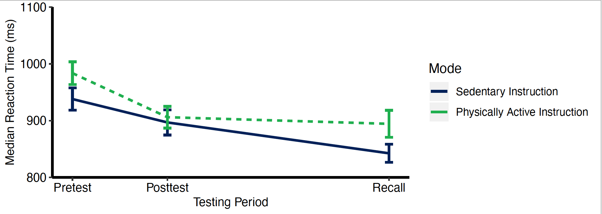

# RFunctions
R Functions that I use and find helpful for analysis as well as graphing data.

## Getting Started
You will need to install packages including but not limited to ggplot, Hmisc, readr, Rmisc, and doBy. 

You can download the folders for the function you would like to use. Each folder contains sample data, R markdown file, and PDF output for any figures created. The PDF can be loaded into Adobe Illustrator and edited as a vector illustration.

AllFunctions is an R markdown file containing the code to all functions.

## Functions List 

* **Chi-Square**: Computes Chi-Square. Examples with Yates' correction and without Yates' correction are provided.
       
       ```r
       RaceChi <- matrix(c(nrow(temp1), nrow(temp2), nrow(temp3), nrow(temp4)),
              nrow = 2,
              dimnames = list("Race" = c("White", "Nonwhite"),
                              "Group" = c("LowFit", "HighFit")))

       # use Yates' correction when at least one cell of table has count < 5
       chisq.test(RaceChi)    
       
       # remove Yates' correction
       chisq.test(RaceChi, correct = FALSE)

       # remove scientific notation
       options(scipen=999)
       ```
* **Bar Graph**: Creates bar graph and saves to PDF that can be imported into Adobe Illustrator as a vector illustration for editing. Image shown is not yet edited in Adobe Illustrator, so does not look perfect.


* **Correlation Plot**: Creates correlation plot and saves to PDF that can be imported into Adobe Illustrator as a vector illustration for editing. Image shown is not yet edited in Adobe Illustrator, so does not look perfect.


* **ERP Waveform Plot**: Creates plot for ERP waveform and saves to PDF that can be imported into Adobe Illustrator as a vector illustration for editing. Image shown is not yet edited in Adobe Illustrator, so does not look perfect.


* **ERP Waveform Plot with Smoothing**: Creates plot for ERP waveforms with smoothing and saves to PDF that can be imported into Adobe Illustrator as a vector illustration for editing. Image shown is not yet edited in Adobe Illustrator, so does not look perfect.


* **Line Graph for Pre Post Designs**: Creates plot for pre/post designs and saves to PDF that can be imported into Adobe Illustrator as a vector illustration for editing. Image shown is not yet edited in Adobe Illustrator, so does not look perfect.


* **Line Graph for Longitudinal Designs**: Creates plot for longitudinal designs with custom spacing for x-axis and saves to PDF that can be imported into Adobe Illustrator as a vector illustration for editing. Image shown is not yet edited in Adobe Illustrator, so does not look perfect.



* **Pupil Waveform Plot**: Creates plot for pupil waveforms and saves to PDF that can be imported into Adobe Illustrator as a vector illustration for editing. Image shown is not yet edited in Adobe Illustrator, so does not look perfect.


* **Scatterplot**: Creates scatterplot and saves to PDF that can be imported into Adobe Illustrator as a vector illustration for editing. Image shown is not yet edited in Adobe Illustrator, so does not look perfect.


* **IndividualPlots**: Creates scatterplot of time series data for each participant with lm regression line and saves each to a page in the same PDF. Helpful for exploratory graphing to determine appropriateness for growth modeling. Image shown is not yet edited in Adobe Illustrator, so does not look perfect (only shows one page, which is one participant).


* **GrowthCurve**: Plot of growth curve model fit in nlme. Can add dashed line and points depciting actual values to compare to model fit.


* **PersonSpecificNetworks**: Makes use of the plot_network_graph function from pompom package in R and same function in qgraph. However, the function can be edited to change aesthetics of the graph (e.g., line color, shape of nodes, etc.). Code to save the graph to a PDF to edit in Illustrator is also provided. Green lines depict positive relationships, red lines depict negative relationships, solid lines represent contemporaneous relationships (same-day), and dashed lines represent lagged (t-1) relationships.


* **Splitting time-varying predictors into between-person (trait) and within-person (state) components**: Function that dissaggregates within-person and between-person effects in longitudinal studies.

Load the functions
```r
              # between-person split function
              bwsplit <- function(var, ID, df){
                centered <- var - (mean(var, na.rm=T))
                varbw <- with(df, ave(centered, ID, FUN=function(x) mean(x, na.rm=TRUE)))
                return(varbw)
              }
              # within-person split function
              wnsplit <- function(var, ID, df){
                varwn <- var - ave(var, ID,FUN=function(x) mean(x, na.rm=T))
                return(varwn)
              }
```
Use the functions
```r
workingdatabase <- read.csv("SampleData.csv")
                                       #variable you want to split, #ID variable, #database you're using
workingdatabase$NegMoodbw <- bwsplit(workingdatabase$NegMood, workingdatabase$PartID, workingdatabase)
workingdatabase$NegMoodwn <- wnsplit(workingdatabase$NegMood, workingdatabase$PartID, workingdatabase)
```


* **Animate Graphs to make GIF**: Use of gganimate package to animate graphs and save GIF for use in presentations.


* **Make prompt, day-level prompt, and day variables for experience-sampling time series data**: Example code to use in data frame to make variables for time series analyses. Requres lubridate package in R.

```{r}
# Set date format
ABCD_prompt$Notification.Time <- lubridate::ymd_hms(ABCD_prompt$Notification.Time)

# Make Date column
ABCD_prompt$Date <- lubridate::as_date(ABCD_prompt$Notification.Time)

# sort by ID and Date
ABCD_prompt <- ABCD_prompt[order(ABCD_prompt$ID, ABCD_prompt$Date),]

# Make prompt variable
ABCD_prompt$Prompt <- ave(as.character(ABCD_prompt$ID), as.character(ABCD_prompt$ID), FUN=seq_along)

#Make DayPrompt (e.g., there are 10 prompts/day and we want 1-10 for each day for certain analyses)
ABCD_prompt$DayPrompt <- ave(as.character(ABCD_prompt$Date), as.character(ABCD_prompt$Date), FUN=seq_along)

# this makes day variable: we want each 1-10 to be labelled as Day 1, day 2, etc…)
ABCD_prompt$Day <- ave(as.character(ABCD_prompt$DayPrompt), as.character(ABCD_prompt$DayPrompt), FUN=seq_along)

# Check
#ABCD_check <- ABCD_prompt[,c("ID", "Notification.Time", "Date", "Prompt", "DayPrompt", "Day")]

```

